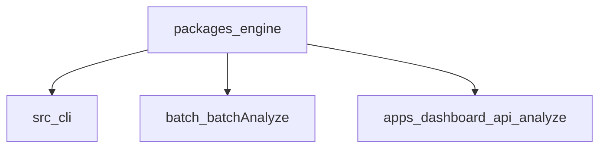
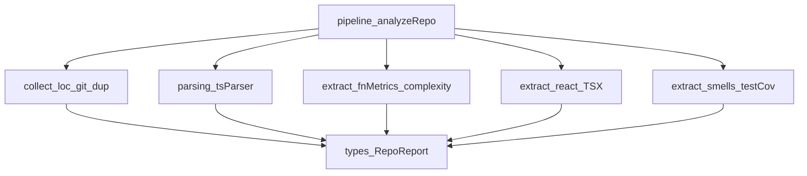
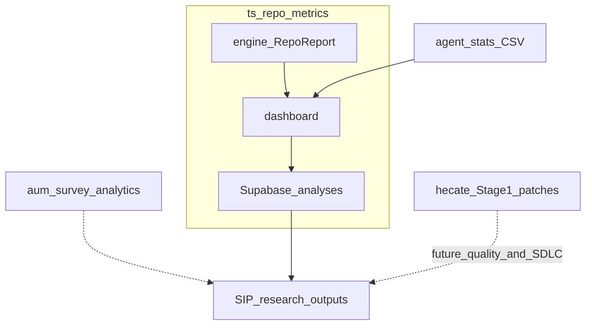

# Architecture

This document describes the module structure and data flow of `ts-repo-metrics`.

For the SIP off-boarding companion, see [HANDOFF.md](HANDOFF.md). Execution-grounded LLM routing (Hecate Stage 1) lives in the sibling repo [`scottyUX/hecate`](https://github.com/scottyUX/hecate) — see that repo’s [ARCHITECTURE.md](https://github.com/scottyUX/hecate/blob/main/docs/ARCHITECTURE.md). These systems are related for research; this dashboard is **not** a live model-routing gate.

## Overview: One Engine, Two Entry Points

The analysis logic lives in a single **engine** package. The **CLI** and the **dashboard API** both import from the engine; nothing is spawned.

| Entry | Role |
|-------|------|
| `src/cli.ts` | Thin wrapper: GitHub URL → `analyzeFromGitHubUrl`; local path → `getSourceMetadata` + `analyzeRepo` |
| `src/batch/batchAnalyze.ts` | Multi-repo analysis via `analyzeRepo` |
| `apps/dashboard/app/api/analyze/route.ts` | In-process engine; cache under `os.tmpdir()`; optional Supabase session + GitHub token |

## Pipeline Overview

- **CLI** (`src/cli.ts`): Parses args; for GitHub URLs calls `analyzeFromGitHubUrl`, for local paths calls `getSourceMetadata` + `analyzeRepo`; batch mode calls `batchAnalyze` (which uses `analyzeRepo` from the engine).
- **Dashboard** (`apps/dashboard/app/api/analyze/route.ts`): Validates URL, resolves an optional Supabase session (GitHub OAuth). If the user has a stored GitHub access token, passes `githubToken` into `analyzeFromGitHubUrl` and uses a per-user `cacheDir` under `os.tmpdir()/repo-metrics-git-cache/u/<userId>/`. Guests use `…/repo-metrics-git-cache/` only. Upserts `analyses` with `user_id` when signed in (null for guests).
- **`cloneOrUseCache`** (`packages/engine/src/collect/gitClone.ts`): Before reusing a cached folder, the engine calls **`simple-git`'s `checkIsRepo()`**. If the directory is not a valid git working tree (e.g. interrupted clone with a broken `.git`), it is **deleted** and a fresh **`git clone`** runs. Without this, analysis could see **no source files** and return **all-zero metrics**.

## GitHub URL Support

- **Engine** provides `analyzeFromGitHubUrl(url, { useCache?, cacheDir?, githubToken? })`: normalizes URL, parses with `parseGitHubUrl`, clones via `cloneOrUseCache(parsed, useCache, cacheDir, githubToken?)` (HTTPS with `x-access-token` when a PAT is set), then `getSourceMetadata` + `analyzeRepo`. Per-request **`githubToken`** overrides `process.env.GITHUB_TOKEN` for clone, zipball, and REST enrichment.
- **CLI** and **API** use this; no subprocess or tsx.

### Zipball and API fallback (Vercel)

When `cloneOrUseCache` fails because the git binary is unavailable (e.g. on Vercel), the engine calls `downloadZipball` with the same optional token. The extracted path has no `.git` directory, so `extractGitMetrics` and `extractGitMetricsV2` return null. `analyzeFromGitHubUrl` then calls `extractGitMetricsApi(parsed, token)` to populate `report.git` from the GitHub REST API. API-derived metrics are proxies (commit metadata only; no diff stats such as lines changed).

Railway Docker deployments include `git` and restore full clone-based git metrics — see [`RAILWAY_DEPLOY.md`](../RAILWAY_DEPLOY.md).

## Dashboard Supabase clients

- **`getSupabase()`** ([`apps/dashboard/lib/supabase/server.ts`](../apps/dashboard/lib/supabase/server.ts)): service role — trusted server writes (e.g. `analyses` upsert, `user_github_tokens` upsert in OAuth callback).
- **`createUserSupabaseServerClient()`** ([`apps/dashboard/lib/supabase/server-user.ts`](../apps/dashboard/lib/supabase/server-user.ts)): anon key + user session cookies — reads subject to **RLS** (e.g. `getReportById`, `GET /api/results/[id]` when anon key is configured).
- **`middleware.ts`**: refreshes the auth session cookie via `@supabase/ssr`.

## Data Flow (Engine Internals)

## Research ecosystem

Sibling research systems used with this repo. They are **not** a unified live routing product.

| System | Role |
|--------|------|
| `ts-repo-metrics` | Static analyzer + dashboard; persists `report_json` / AI usage CSV |
| `agent_stats` | Local Cursor / Claude Code / Codex / Gemini logs → `ai_usage_trace.csv` |
| `aum-survey-analytics` | Qualtrics → AUM/TAM replication pipeline |
| `hecate` | SWE-bench Lite Stage 1 patch generation; DistilBERT router is future work |

## Phase 2 (lexical / cognitive / GRAD-AI MI)

Per-function extraction runs in `extract/functionMetrics.ts` (with `parsing/tokenScanner.ts` for Halstead atoms, `extract/halstead.ts`, `extract/cognitiveComplexity.ts`, `utils/metrics.ts` for `MI_raw` / `MI_norm`). Cyclomatic branch counting is shared with `extract/complexity.ts` via `countCyclomaticBranchPoints`. The dashboard **Dataset** tab aggregates Phase 2 metrics into `featureVector.ts`; the **Lexical** results tab (lexical / cognitive / GRAD-AI MI) shows per-function tables, repo-level summary cards, a **metric glossary** (definitions, LaTeX formulas, citations), and a collapsible **Threshold calibration** table (academic/industry sources + significance). Cell backgrounds for `MI_norm`, CC, and cognitive complexity follow [`apps/dashboard/lib/phase2Traffic.ts`](../apps/dashboard/lib/phase2Traffic.ts) (GRAD-AI / Sonar-style bands; see `docs/METRICS_CONCEPTS.md`).

## Phase 3 (AI smells / pathology)

`extract/silentFailures.ts` scans **`.tsx`** try/catch nodes for empty or console-only catches. `analyzeRepo.ts` aggregates **SFD**, **MCR** (`isMonolithic` on `FunctionDetail` when `isReactComponent && lines > threshold`), and **SRS** from jscpd duplicate JSON via `collect/weightedRedundancy.ts`. The dashboard **AI smells** tab shows KPI cards and tables; optional `phase3_*` columns are emitted in `featureVector.ts` when `report.phase3` is present.

## AI session logs (dashboard AI Usage tab)

The dashboard **AI Usage** tab parses agent session exports **in the browser** and produces a versioned `SessionLogReport` (see [`apps/dashboard/lib/aiSessionLogAnalyzer.ts`](../apps/dashboard/lib/aiSessionLogAnalyzer.ts)). User-facing steps and privacy notes: [AI_USAGE_LOGS.md](AI_USAGE_LOGS.md).

Longer-term ingestion into the **`RepoReport`** pipeline (git enrichment, metrics bridge) remains specified in [planning/AI_SESSION_LOG_ANALYZER.md](planning/AI_SESSION_LOG_ANALYZER.md) and is not required for the tab today.

## Module Responsibilities

| Location | Purpose |
|----------|---------|
| `packages/engine` | Pure analysis: pipeline, collect, parsing, extract, types, utils. Builds to `dist/`. Consumed by CLI and dashboard. |
| `packages/engine/src/index.ts` | Exports `analyzeRepo`, `analyzeFromGitHubUrl`, `getSourceMetadata`, `parseGitHubUrl`, React report types, and key types. |
| `packages/engine/src/extract/react/` | RQ3 React metrics: TSX components, hooks, JSX depth, Ferreira/Tampere-style flags, prop pass-through MVP, hook safety heuristics. |
| `packages/engine/src/collect/gitMetricsApi.ts` | GitHub REST API fallback for git metrics when git CLI unavailable (Vercel zipball mode). |
| `src/cli.ts` | CLI entrypoint — imports from `@repo-metrics/engine`; routes single (URL vs path) and batch. |
| `src/batch/` | Batch analysis over multiple repos; imports `analyzeRepo` and `RepoReport` from the engine. |

## Adding a New Extractor

1. **Define the type** in `packages/engine/src/types/report.ts` and add the field to `RepoReport`.
2. **Create the extractor** in `packages/engine/src/extract/` (AST-based) or `packages/engine/src/collect/`.
3. **Add constants/thresholds** to `packages/engine/src/utils/constants.ts`.
4. **Integrate** in `packages/engine/src/pipeline/analyzeRepo.ts`.
5. **Update docs** — `docs/SCHEMA.md`, `README.md`, and (for RQ-sized features) `docs/planning/`.

## Build and Test

- **Engine**: `cd packages/engine && npm run build` (output in `dist/`). Tests: `packages/engine/__tests__/`; run from root with `npm run test` or from engine with `npm run test`.
- **Dashboard**: `npm run build` from `apps/dashboard` runs `build:engine` then `next build`. The API route uses `@repo-metrics/engine` (no spawn). Dashboard unit tests (e.g. `apps/dashboard/__tests__/`) run with root `npm run test` when included in `vitest.config.ts`.

## Shared Code Rules

- Reusable constants → `packages/engine/src/utils/constants.ts`
- Reusable utilities → `packages/engine/src/utils/<topic>.ts`
- Shared interfaces → `packages/engine/src/types/report.ts`
