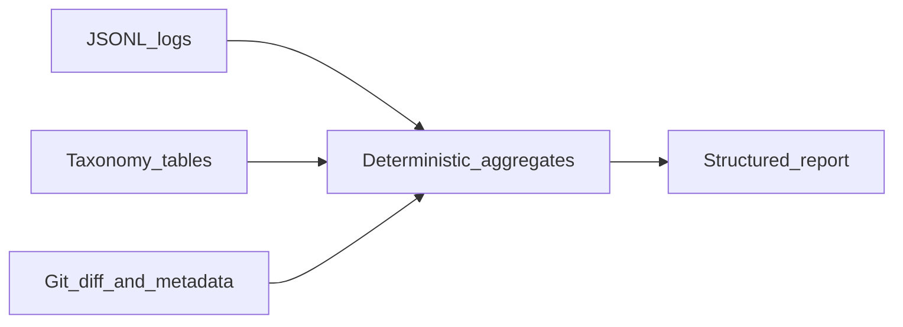

# AI session log analyzer — design (enrichment + metrics bridge)

This document defines the **data contract** for a future analyzer that ingests **Claude Code–style session logs** (JSON Lines) and produces a structured report. It complements the static `RepoReport` from `packages/engine`; it does not change [SCHEMA.md](../SCHEMA.md) until log-derived fields are implemented.

## Purpose and scope

The analyzer:

- Ingests **session JSONL** (and optionally a **repository path** + **git revision(s)** for enrichment).
- Emits **deterministic aggregates** where possible (token sums, tool mix, stuck signals from repeated errors), plus optional **LLM-authored narrative** that must **not** invent counts—only explain numbers already computed.
- Aligns KPIs with product concepts such as archetype (“Senior Orchestrator”), **scorecard** dimensions (efficiency, safety/compliance, discovery depth), **top behavioral patterns**, and **stuck analysis** (loops, friction files).

### Out of scope for dashboard v1

Binding session logs into the **`RepoReport` engine response** or embedding a live analyzer in the **analyze** API is still **deferred** until parsing and enrichment are stable. The dashboard **AI Usage** tab supports **CSV** and **JSON/JSONL session exports** (browser-side parsing + the session report panel below); Git-enriched metrics remain client-side “N/A” stubs until wired.

## Output summary (artifact shape)

Reports should be **versioned** and stable for consumers (API, UI, exports). A minimal shape:

- **Envelope:** `logAnalyzerVersion`, `generatedAt`, `input` (format, session count, optional file hash), `warnings` (parse issues).
- **`sessions[]`:** per-session boundaries, turn counts, tool/error counts, optional token roll-ups.
- **`aggregates`:** repo- or export-wide totals (tool mix, token totals, loop counts).
- **`metrics`:** named KPIs; each may be **null** with `reason` when primary data is missing (see below).
- **Optional:** `scorecard` (efficiency, safety_compliance, discovery_depth), `archetype`, `top_patterns[]`, `stuck_analysis`, `ai_coaching_tips[]`, `narrative` (if an LLM summarizes **only** computed features).

Missing **primary** JSONL fields (e.g. no `usage` records) ⇒ related metrics are **null** with a documented `reason`, not guessed.

### Efficiency breakdown (`scorecard.efficiencyBreakdown`)

The browser-side report includes **derived components** of `scorecard.efficiency` (0–1, shown as % in the UI):

- **`avgToolsPerPrompt`** — `tool_call` count ÷ `user_prompt` count (minimum 1 prompt).
- **`iterScore`** (0–1) — rewards fewer tools per prompt: `clamp(0, 1, 1 - max(0, avgToolsPerPrompt - 1) / 8)`.
- **`discoverScore`** (0–1) — from discovery ratio: `min(1, discoveryRatio × 1.35)`, or `0.5` if ratio is unavailable.
- **`efficiency`** — `0.55 × iterScore + 0.45 × discoverScore`, clamped and rounded to 2 decimal places.

Bump **`logAnalyzerVersion`** if any of these formulas change.

## Data enrichment requirement

Every derived KPI should be traceable to:

1. **Primary source** — fields present in the **JSONL** export (or explicitly “not available in export”).
2. **Secondary source** — **enrichment** from git, configurable taxonomies, regex libraries, or joins to `RepoReport` when the same repo is analyzed by the engine.
3. **Difficulty** — **Low**, **Medium**, or **High** for implementation and maintenance.

### Token usage (first-class metrics)

When the export includes **usage** (or per-turn token fields), treat these as **primary**:

- **Total input / output / (optional) reasoning tokens** — summed per session and overall from `usage` (or vendor-specific equivalents on each turn).
- **Per-turn token series** — if logged, supports **context saturation** heuristics (e.g. turns where input tokens approach a **context window** limit). Secondary: **model context window** from product docs or config if not in JSONL.
- **Token ROI** — not raw token counts alone: combines token aggregates with **units of delivered change** from git (see bridge table). **High** difficulty due to join semantics.

### Bridge table (metric → sources → difficulty)

| Metric | Primary source (JSONL) | Secondary source (enrichment) | Difficulty |
|--------|---------------------------|-------------------------------|------------|
| **Total / per-turn tokens; reasoning split (if exported)** | `usage` (or per-turn vendor token fields) | None for totals; optional **model context window** for saturation **%** | **Low** if usage exists; **High** if export omits tokens entirely |
| **Token ROI** (tokens per unit of delivered change) | Token aggregates + session boundaries | **Git diff** at commit (lines added/removed, files touched); optional LOC from **`analyzeRepo`** on same checkout | **High** |
| **Discovery ratio** (discovery vs action) | Tool **names** and tool-call stream | **Taxonomy mapping table** (classify tools as discovery vs action) | **Low** once taxonomy is maintained |
| **Stuck score** (loops, friction) | `tool_result` **status** / errors; repeated tool + argument pairs | **Regex / fingerprint** library for known failure patterns; optional path aggregation | **Medium** |
| **Verification frequency** | **Shell/bash** (or run-command) invocations; tool names | **Command regex** (e.g. `*test*`, jest, vitest, pytest) | **Low** |
| **Manual intervention** proxy (human edited after AI) | Assistant text alone is a weak signal | **`git diff` at commit time** vs AI-attributed edits (requires an **attribution strategy**) | **High** |
| **Archetype / scorecard** (`efficiency`, `safety_compliance`, `discovery_depth`) | Behavioral features from JSONL (+ tokens when present) | Optional **rules** or **LLM scorer** consuming **only** computed features; thresholds versioned | **Medium**–**High** |
| **Top patterns** (e.g. “Verify-Before-Commit”, “Blind Edit (No Search)”) | Ordered tool/message/event patterns | **Pattern definitions** (rules or ML); taxonomy + sequence detection | **Medium** |
| **Hallucination / file-not-found index** | Errors from **`tool_result`**, missing-path signals | Optional **path validation** vs repo snapshot at same revision | **Medium** |
| **Prompt-to-commit density** | User prompts / turn boundaries from JSONL | **Git** commits (timing or message correlation) | **High** |
| **Stuck analysis** (`total_loops`, `average_loop_depth`, `top_friction_file`) | Same as stuck score / loop detection | **File-level roll-up** — paths extracted from tool args/results; clarify **units** for `average_loop_depth` (e.g. retries per loop) | **Medium** |

## Join model

**Token ROI**, **manual intervention**, and **prompt-to-commit** need a reproducible link between **log sessions** and **git history**:

- Prefer attaching each session (or segment) to a **commit SHA** or a **time-bounded window** over a known **branch** + **workspace path**.
- Diff-based metrics should use the **same checkout** as the log when possible so line numbers and paths align.
- Document whether joins are **best-effort** (timestamp overlap) versus **explicit** (IDE or exporter embeds commit id in metadata).

## Versioning

- Bump **`logAnalyzerVersion`** when: JSONL schema changes, taxonomy rows change, or a bridge-table metric’s definition changes.
- Keep **pattern catalogs** (regex, tool classification) under version control with the analyzer so historical reports remain interpretable.

## Related repo documentation

- [ARCHITECTURE.md](../ARCHITECTURE.md) — engine pipeline and `RepoReport`.
- [SCHEMA.md](../SCHEMA.md) — static analysis JSON output (unchanged by this design until integrated).
